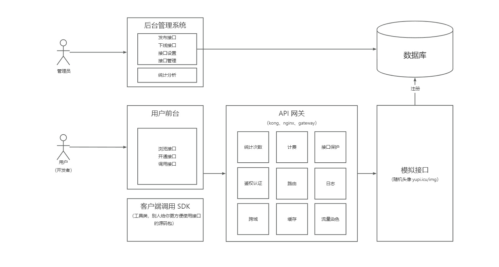
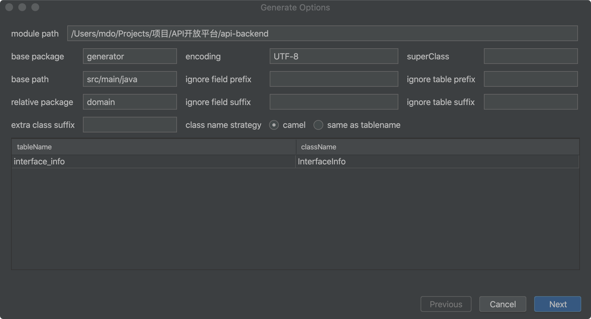
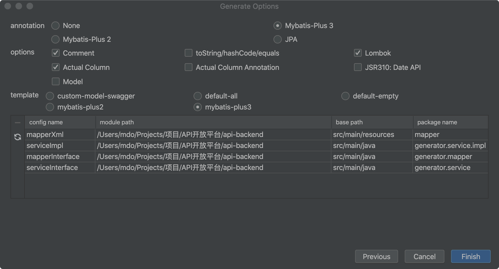
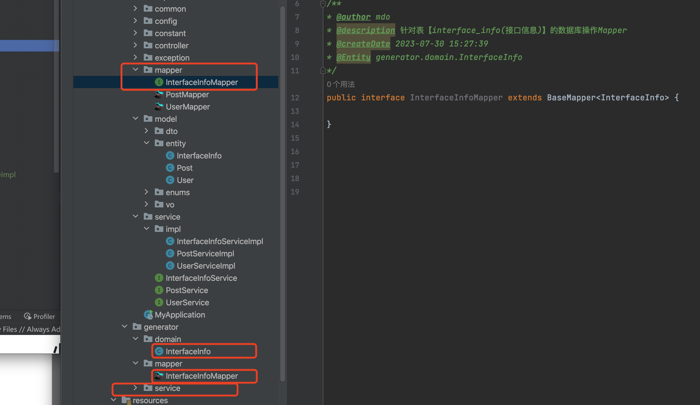
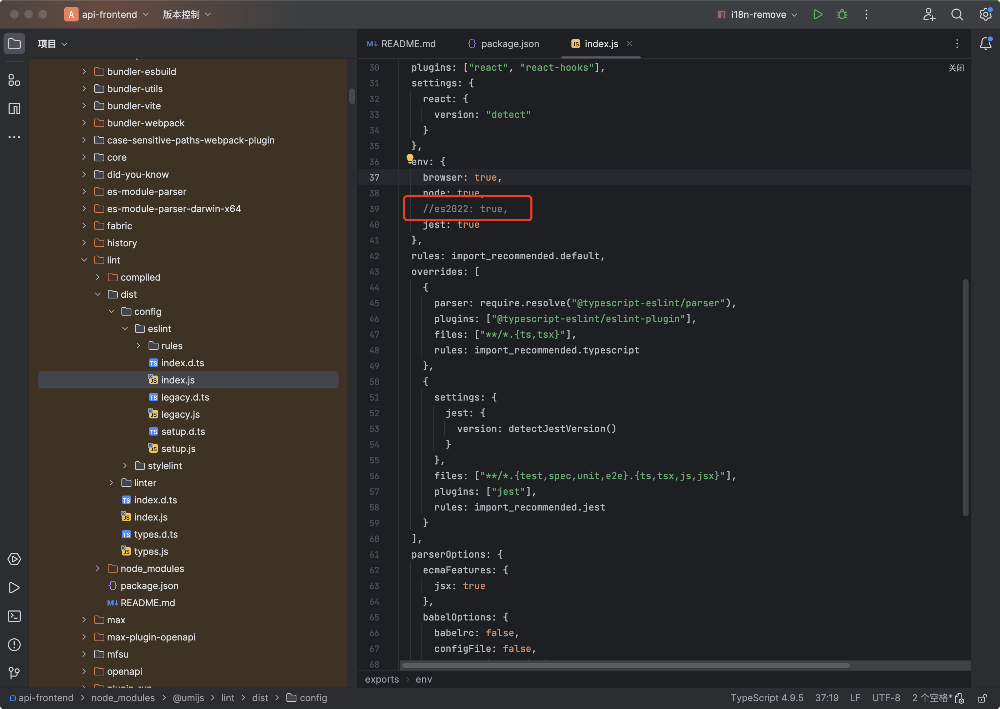

# API开放平台

背景：

1. 前端开发需要用到的后台接口
2. 实用现成的系统的功能 [博天api](http://api.btstu.cn/)(http://api.btstu.cn/)


做一个API接口平台：

1. 防止攻击(安全性)
2. 不能随便调用(限制、开通)
3. 统计调用次数
4. 计费
5. 流量保护
6. API接入


## 项目介绍

Nero-API 接口开放平台前端代码仓库。 这是一个提供API接口供开发者调用的平台 用户可以登录、注册，开通接口调用权限。接口的调用会被统计，后续可能收费。 管理员可以发布接口、下线接口、接入接口，以及在线调试接口。


## 项目背景

1. 前端开发都需要使用后端接口来获取数据。
2. 网上有很多现成的API接口调用平台

自己动手做一个API接口平台：

1. 用户可以访问前台，登录、注册，开通、关闭接口调用权限。
2. 管理员可以对接口进行增删改查

要求：

1. 防止攻击（安全性）

2. 不能随意调用（限制、开通）

3. 统计调用次数

4. 流量保护

5. API接入

   

## 技术选型

### 前端

- Ant Design Pro
- React
- Ant Design Procomponents
- Umi
- Umi Request（Axios的封装）

### 后端

- Spring Boot
- Spring Cloud Gateway
- Dobbo
- Nacos
- Spring Boot Starter（SDK开发）


## 项目介绍

​	做一个提供API接口调用的平台，用户可以注册登录，开通接口调用权限。用户可以使用接口，并且每次调用会进行统计。管理员可以发布接口、下线接口、接入接口，以及可视化接口的调用情况、数据。


## 业务流程



## 技术选型


## 前端

- React 18
- Ant Design Pro 5.x 脚手架
- Ant Design & Procomponents 组件库
- Umi 4 前端框架
- OpenAPI 前端代码生成


## 后端

- Java Spring Boot
- MySQL 数据库
- MyBatis-Plus 及 MyBatis X 自动生成
- API 签名认证（Http 调用）
- Spring Boot Starter（SDK 开发）
- Dubbo 分布式（RPC、Nacos）
- Swagger + Knife4j 接口文档生成
- Spring Cloud Gateway 微服务网关
- Hutool、Apache Common Utils、Gson 等工具库


## Ant Design Pro

官方文档：https://ant-design-pro.gitee.io/zh-CN/docs/getting-started

## 前端项目安装启动

```js
yarn install
yarn start
```

### 移除国际化

- i18n-remove 报错
  - 执行 yarn add eslint-config-prettier --dev
  - 执行 yarn add eslint-plugin-unicorn --dev
  - 修改node_modules/@umijs/lint/dist/config/eslint/index.js文件：注释 // es2022: true

## open api生成前端接口调用

- package.json

```js
"openapi": "max openapi",
```

- 配置 config/config.ts

```tsx
export default defineConfig({
	openAPI: [
        {
          requestLibPath: "import { request } from '@umijs/max'",
            // 后端openapi 地址
          schemaPath: 'http://localhost:8081/v3/api-docs',
          projectName: 'api-backend',
        },
      ],
})
```


## 请求配置

- src/requestConfig.ts

```tsx
export const requestConfig: RequestConfig = {
  // 方式1：跨域访问方式，需要添加配置withCredentials: true, 才能携带cookie
  // baseURL: 'http://localhost:8081',
  
  // 方式2：公共前缀 + proxy 代理方式 config/proxy.ts
  baseURL: '/api',
}
```

- 完整配置

```tsx
export const requestConfig: RequestConfig = {
  // 方式1：跨域访问方式，需要添加配置withCredentials: true, 才能携带cookie
  // baseURL: 'http://localhost:8081',
  // 方式2：公共前缀 + proxy 代理方式 config/proxy.ts
  baseURL: '/api',

  // 请求拦截器
  requestInterceptors: [
    (config: RequestOptions) => {
      // 拦截请求配置，进行个性化处理。
      const url = config?.url;
      return { ...config, url };
    },
  ],

  // 响应拦截器
  responseInterceptors: [
    (response) => {
      // 拦截响应数据，进行个性化处理
      // data: res 重新分配参数
      const { data: res } = response as unknown as ResponseStructure;
      if (res?.success === false) {
        notification.error({
          description: '请求错误',
          message: '提示',
        });
        throw Error('请求错误');
      }
      const { code, message, data } = res;
      if (code !== 0) {
        notification.error({
          description: message,
          message: '提示',
        });
        throw Error(message);
      }
      /**
       * TODO 这里返回response，实际后面调用获取的是response.data，也就是{ code, message, data }
       * 官方说通过配置 request.dataField = '' 可以获取原始数据，实际上未生效
       */
      return response;
    },
  ],

  // 携带cookie 跨域请求
  // withCredentials: true,
};
```


## 登录

- src/pages/user/Login/index.tsx

  - 核心方法handleSubmit
  - 获取用户信息fetchUserInfo，调用src/app.tsx getInitialState() 获取

```tsx
const Login: React.FC = () => {
  const [userLoginState, setUserLoginState] = useState<API.LoginResult>({});
  const [type, setType] = useState<string>('account');
  const { initialState, setInitialState } = useModel('@@initialState');
  const fetchUserInfo = async () => {
    // 获取userinfo信息，这里调用的fetchUserInfo是个Promisee函数
    const userInfo = await initialState?.fetchUserInfo?.();
    if (userInfo) {
      flushSync(() => {
        setInitialState((s) => ({
          ...s,
          currentUser: userInfo,
        }));
      });
    }
  };
  const handleSubmit = async (values: API.UserLoginRequest) => {
    // 登录
    try {
      // 判断能否正常登录
      const res = await userLoginUsingPOST({
        ...values,
      });
      if (res) {
        const defaultLoginSuccessMessage = '登录成功！';
        notification.success({
          description: defaultLoginSuccessMessage,
          message: '提示',
        });
        // 可以登录，获取用户信息并设置到全局状态
        await fetchUserInfo();
        console.log('fetchUserInfo initialState', initialState);
        const urlParams = new URL(window.location.href).searchParams;
        // setInitialState(res.data);
        console.log('routes', urlParams.get('redirect') || '/');
        history.push(urlParams.get('redirect') || '/');
        return;
      }
    } catch (e) {
      // 如果失败去设置用户错误信息
      const state: API.LoginResult = { status: 'error', type: 'account' };
      setUserLoginState(state);
    }
  };
};
```


  全局用户状态

- src/app.tsx

```tsx
/**
 * @see  https://umijs.org/zh-CN/plugins/plugin-initial-state
 * 全局状态管理，通过useModel('@@initialState') 获取
 * */
export async function getInitialState(): Promise<{
  settings?: Partial<LayoutSettings>;
  currentUser?: API.LoginUserVO;
  loading?: boolean;
  fetchUserInfo?: () => Promise<API.LoginUserVO | undefined>;
}> {
  // 获取用户信息
  const fetchUserInfo = async () => {
    try {
      const res = await getLoginUserUsingGET();
      console.log('fetchUserInfo res', res);
      return res.data;
    } catch (error) {
      history.push(loginPath);
    }
    return undefined;
  };
  // 如果不是登录页面，执行
  const { location } = history;
  if (location.pathname !== loginPath) {
    const currentUser = await fetchUserInfo();
    return {
      fetchUserInfo,
      currentUser,
      settings: defaultSettings as Partial<LayoutSettings>,
    };
  }
  return {
    fetchUserInfo,
    settings: defaultSettings as Partial<LayoutSettings>,
  };
}

export const layout: RunTimeLayoutConfig = ({ initialState, setInitialState }) => {
  return {
    // 页面路由改变时回调
    onPageChange: () => {
      const { location } = history;
      // 如果没有登录，重定向到 login
      if (!initialState?.currentUser && location.pathname !== loginPath) {
        history.push(loginPath);
      }
    },
  };
};
```

## 登出

- src/components/RightContent/AvatarDropdown.tsx
  - userLogoutUsingPOST

```tsx
export const AvatarDropdown: React.FC<GlobalHeaderRightProps> = ({ menu, children }) => {
  /**
   * 退出登录，并且将当前的 url 保存
   */
  const loginOut = async () => {
    await userLogoutUsingPOST();
  }
  ...
```

## 路由权限

- src/access.ts

```tsx
/**
 * @see https://umijs.org/zh-CN/plugins/plugin-access
 * */
export default function access(initialState: { currentUser?: API.LoginUserVO } | undefined) {
  const { currentUser } = initialState ?? {};
  return {
    canAdmin: currentUser && currentUser.userRole === 'admin',
  };
}
```


## User注册

-  Mybatis-Plus默认的主键策略是：ASSIGN_ID(使用雪花算法） 

```java
@TableName(value = "user")
@Data
public class User implements Serializable {

    /**
     * id
     如果没有配置策略，则默认为ASSIGN_ID
     */
    @TableId(type = IdType.ASSIGN_ID)
    private Long id;
}
```

## ProTable 表单

- protable通常用来做查询+ 列表的高级组件，但是也可以用来crud，官方文档提供参数type={'form'}，来转换为表单，目前使用有bug

  - 方式一：request提交：重置表单会重复调用请求，解决方式，onReset函数会先于request调用，onReset设置标志区分是否reset

  - 方式二：onSubmit提交（建议使用这种）form 表单init数据 

    - ```
      form={{
      	initialValues: !isAdd ? currentRow : {},
      }}
      ```

- status Integer类型数据回显问题，valueEnum枚举类型，如果key是数字，回显会直接显示数字

  - 暂时解决方式 ，提前赋值为字符串，record.status += '';

- Add/Update Form表单组件

  - 封装单独组件

    ```tsx
     {/* add or update form */}
    <EditForm
        isAdd={isAdd}
        open={open}
        onCancel={cancel}
        onSubmit={submit}
        currentRow={currentRow}
        columns={columns}
        />
    ```

    

- modal表单中传入值的问题：ProTable中会初始化一次属性，再次打开时候，组件已经赋值，所以有两种解决方式，要么监听外层属性变化，然后重新为表单赋值，要么销毁modal，下次打开重新加载数据

  - 方式一：监听

    ```tsx
    // ProForm ref
      const ref = useRef<ProFormInstance>();
    
      // 类似Vue watch， 参数：(执行某个函数,监听的属性列表)
      useEffect(() => {
        // 当外层传入值发生改变时重新设置表单值
        ref?.current?.setFieldsValue(currentRow);
      }, [currentRow]);
    ```

  - 方式二：直接销毁modal

    ```tsx
     <Modal
          ...
          destroyOnClose={true}
        >
    ```


# 服务端

## maven子项目总览

- api-admin 后端管理，为前端项目提供数据支持
  - 用户登录，session存储用户状态
  - 接口api的增删改查
- api-client-demo 集成starter的测试客户端
  - 测试通过给定的ak ，sk以及starter提供的客户端能否成功调用服务端接口
- api-client-sdk ApiClient sdk
  - 提供访问api接口的功能
- api-client-sdk-autoconfiguration 自动配置ApiClient
- api-client-sdk-starter 集成sdk starter
- api-common 公共类库
- api-gateway
  - api网关，主要实现了白名单，api鉴权和日志打印的功能
- api-gateway-mock
  - 为gateway提供接口模拟测试
- api-interface api提供服务端
  - 提供对外访问接口
  - 通过拦截器判断是否是合法的api访问请求

## 代码生成

- 插件 MybatisX
  - options Actual Column 与库表一致
  - mybatis-plus3

## Knife4j 接口文档配置

```java
/**
 * Knife4j 接口文档配置
 * https://doc.xiaominfo.com/knife4j/documentation/get_start.html
 */
@Configuration
@EnableSwagger2
@Profile({"dev", "test"})
public class Knife4jConfig {

    @Bean
    public Docket defaultApi2() {
        return new Docket(DocumentationType.OAS_30)
                .apiInfo(new ApiInfoBuilder()
                        .title("接口文档")
                        .description("api-backend")
                        .version("1.0")
                        .build())
                .select()
                // 指定 Controller 扫描包路径
                .apis(RequestHandlerSelectors.basePackage("io.web.api.controller"))
                .paths(PathSelectors.any())
                .build();
    }
}
```

## BeanValidation简化参数校验

- maven依赖

```xml
<!-- bean validation-->
<dependency>
    <groupId>javax.validation</groupId>
    <artifactId>validation-api</artifactId>
    <version>2.0.1.Final</version>
</dependency>
<dependency>
    <groupId>org.hibernate.validator</groupId>
    <artifactId>hibernate-validator</artifactId>
    <version>6.0.11.Final</version>
    <scope>compile</scope>
</dependency>
```

- BeanValidation快速失败配置（一个校验失败直接抛出）

```java
@Configuration
public class BeanValidationConfig {

    @Bean
    public Validator validator() {
        ValidatorFactory factory = Validation.byProvider(HibernateValidator.class)
                .configure()
                .failFast(true)
                .buildValidatorFactory();
        return factory.getValidator();
    }
}
```

## 接口调用

1. HttpClient

2. RestTemplate
3. Hutools


## API签名认证

本质：

1. 签发签名
2. 校验签名

### 实现方式

> 为用户分配ak和sk，在进行api调用时，验证用户传递的和数据库分配的值是否一致

- AccessKey
- SecretKey

## 参数

- 参数1：nonce 随机数
- 参数2：用户参数
- 参数3：时间戳
- 参数4：ak
- 参数5：sign 用户参数 + 密钥（sk） => 签名算法 => 不可解密的加密值

### 防重放？

nonce随机数，只能用一次，服务端要保存随机数

加timestamp时间戳，校验时间戳是否过期


## 接口发布下线

发布接口（admin）

1. 接口是否存在
2. 是否可以调用
3. 修改状态为1

下线接口（admin）

1. 接口是否存在
2. 状态为0

## 接口模拟调试调用


## 网关

- 统一接受和分发请求
- 鉴权
- 跨域
- 缓存
- 流量染色
- 访问控制
- 统一业务处理
- 发布控制
- 负载均衡
- 接口保护
  - 限流
  - 脱敏
  - 降级
  - 超时
- 统一日志
- 统一文档

### 网关分类

1. 全局网关（接入层网关）：负载均衡
2. 业务网关（微服务网关）：请求转发到不同的项目/业务/接口/服务

### 实现

1. Nginx（全局）、Kong（API网关）
2. Spring Cloud Gateway（取代了Zuul）、高性能

# Spring Cloud Gateway

https://spring.io/projects/spring-cloud-gateway#overview

## maven依赖

```xml
<spring-cloud.version>2021.0.7</spring-cloud.version>

<dependencyManagement>
    <dependency>
        <groupId>org.springframework.cloud</groupId>
        <artifactId>spring-cloud-dependencies</artifactId>
        <version>${spring-cloud.version}</version>
        <type>pom</type>
        <scope>import</scope>
    </dependency>
</dependencyManagement>

<dependencies>
        <dependency>
            <groupId>org.springframework.cloud</groupId>
            <artifactId>spring-cloud-starter-gateway</artifactId>
        </dependency>
        <dependency>
            <groupId>org.springframework.boot</groupId>
            <artifactId>spring-boot-starter-test</artifactId>
            <scope>test</scope>
        </dependency>
    </dependencies>
```

## 配置断言和过滤器的两种方式

- Shortcut 快捷方式

  ```yaml
  spring:
    cloud:
      gateway:
        routes:
        - id: after_route
          uri: https://example.org
          predicates:
  		// 满足这个断言，cookie的名称是mycookie，value是mycookievalue
          - Cookie=mycookie,mycookievalue
  
  ```

- Fully Expand Arguments 参数展开

```yaml
spring:
  cloud:
    gateway:
      routes:
      - id: after_route
        uri: https://example.org
        predicates:
        - name: Cookie
          args:
            name: mycookie
            regexp: mycookievalue

```

## 断言工厂

- `After` route predicate factory 在什么时间后

- `Before` route predicate factory 什么时间前

- `Between` route predicate factory  给定时间之间

- `Cookie` route predicate factory takes two parameters, the cookie `name` and a `regexp` (which is a Java regular expression).  给定Cookie

- `Header` route predicate factory takes two parameters, the `header` and a `regexp` 请求头

- `Host` route predicate factory takes one parameter: a list of host name `patterns`  域名

- `Method` Route Predicate Factory takes a `methods` argument which is one or more parameters: the HTTP methods to match. 给定http请求

- `Path` Route Predicate Factory 

  ```yaml
  spring:
    cloud:
      gateway:
        routes:
        - id: path_route
          uri: https://example.org
          predicates:
          - Path=/red/{segment},/blue/{segment}
  
  ```

  - This route matches if the request path was, for example: `/red/1` or `/red/1/` or `/red/blue` or `/blue/green`. 

  - If `matchTrailingSlash` is set to `false`, then request path `/red/1/` will not be matched.  不匹配行尾斜线

  - ServerWebExchange.getAttributes() + ServerWebExchangeUtils.URI_TEMPLATE_VARIABLES_ATTRIBUTE 获取 segment的值，或者

    ```java
    Map<String, String> uriVariables = ServerWebExchangeUtils.getUriTemplateVariables(exchange);
    
    String segment = uriVariables.get("segment");
    ```

- `Query` route predicate factory  

  -  Query=green 
  -  Query=red, gree.  参数名称是red，值是gree.  ，so `green` and `greet` would match. 

- `RemoteAddr` route predicate factory 

- `Weight` route predicate factory takes two arguments: `group` and `weight` (an int).  权重

  ```yaml
  spring:
    cloud:
      gateway:
        routes:
        - id: weight_high
          uri: https://weighthigh.org
          predicates:
          - Weight=group1, 8
        - id: weight_low
          uri: https://weightlow.org
          predicates:
          - Weight=group1, 2
  
  ```

- `XForwarded Remote Addr` route predicate factory takes a list (min size 1) of `sources` 


## 过滤器工厂

- `AddRequestHeader` `GatewayFilter` factory takes a `name` and `value` parameter 

- `AddRequestHeadersIfNotPresent` `GatewayFilter` factory takes a collection of `name` and `value` pairs separated by colon （冒号）

- `AddRequestParameter` `GatewayFilter` Factory takes a `name` and `value` parameter.  

- `AddResponseHeader` `GatewayFilter` Factory takes a `name` and `value` parameter

- Spring Cloud CircuitBreaker GatewayFilter 

  -  To enable the Spring Cloud CircuitBreaker filter, you need to place `spring-cloud-starter-circuitbreaker-reactor-resilience4j` on the classpath.  需要引入`resilience4j` 

- trip a circuit breaker based on the status code 根据状态码触发断路器

- Some situations necessitate reading the request body. 有些情况需要读取请求体。 请求只能被读取一次，使用 CacheRequestBody 缓存请求体

- `DedupeResponseHeader` GatewayFilter factory takes a `name` parameter and an optional `strategy` parameter. 

- FallbackHeaders 允许您在转发到外部应用程序中的fallbackUri的请求头中添加Spring Cloud CircuitBreaker执行异常细节 

- The JSONToGRPCFilter GatewayFilter Factory converts a JSON payload to a gRPC request. 

- LocalResponseCache 响应缓存，规则

  -  无主体GET请求。 
  -  指定响应码 200、206、301
  -  Cache-Control报头不允许(请求中没有存储或响应中没有存储或私有)，则不缓存响应数据。 
  -  如果响应已经被缓存，并且在新请求Cache-Control头中 no-cache ，它将返回一个带有304(未修改)的无实体响应。 

- The `MapRequestHeader` `GatewayFilter` factory takes `fromHeader` and `toHeader` parameters. 

- You can use the `ModifyRequestBody` filter to modify the request body before it is sent downstream by the gateway. 修改请求体

- You can use the `ModifyResponseBody` filter to modify the response body before it is sent back to the client.修改响应体

- The `PrefixPath` `GatewayFilter` factory takes a single `prefix` parameter. The following example configures a `PrefixPath` `GatewayFilter`:  添加请求前缀

- `PreserveHostHeader` `GatewayFilter` 

- `RedirectTo` `GatewayFilter`  重定向

- `RemoveJsonAttributesResponseBody` `GatewayFilter` factory takes a collection of `attribute names` to search for,   删除responsebody中的属性，最后一个参数可选（true则递归删除属性）

- `RemoveRequestHeader` `GatewayFilter` factory takes a `name` parameter. 

- `RemoveRequestParameter` `GatewayFilter` factory takes a `name` parameter 

- `RemoveResponseHeader` `GatewayFilter` factory takes a `name` parameter 

- `RequestHeaderSize` `GatewayFilter` factory takes `maxSize` and `errorHeaderName` parameters. 

- `RequestRateLimiter` `GatewayFilter` factory uses a `RateLimiter` implementation to determine if the current request is allowed to proceed 

  -  KeyResolver 

  -  Redis RateLimiter， 添加`spring-boot-starter-data-redis-reactive` Spring Boot starter. 
     -  The `redis-rate-limiter.replenishRate` property defines how many requests per second to allow ，填充速率配置，允许每秒执行的请求
     -  The `redis-rate-limiter.burstCapacity` property   用户在一秒钟内允许的最大请求数(不丢弃任何请求)。  这是令牌桶可以容纳的令牌数量。将此值设置为零将阻止所有请求。 
     -  The `redis-rate-limiter.requestedTokens` property    请求花费的令牌数量 , 这是为每个请求从桶中获取的令牌数量，默认为1。 

- `RewriteLocationResponseHeader` `GatewayFilter` 

- `RewritePath` `GatewayFilter` factory 

  -  `/red/blue`, this sets the path to `/blue` 

  ```yaml
  spring:
    cloud:
      gateway:
        routes:
        - id: rewritepath_route
          uri: https://example.org
          predicates:
          - Path=/red/**
          filters:
          - RewritePath=/red/?(?<segment>.*), /$\{segment}
  
  ```

- `RewriteResponseHeader` `GatewayFilter` 

- `SaveSession` `GatewayFilter` factory forces a `WebSession::save` 

- `SecureHeaders` `GatewayFilter` factory  

- `SecureHeaders` `GatewayFilter` factory  

  ```yaml
  spring:
    cloud:
      gateway:
        routes:
        - id: setpath_route
          uri: https://example.org
          predicates:
          - Path=/red/{segment}
          filters:
          - SetPath=/{segment}
  
  ```

- `SetRequestHeader` `GatewayFilter`  

- `SetResponseHeader` `GatewayFilter`  

- `SetStatus` `GatewayFilter` factory 

- `StripPrefix` `GatewayFilter`  删掉前缀

  ```yaml
  spring:
    cloud:
      gateway:
        routes:
        - id: nameRoot
          uri: https://nameservice
          predicates:
          - Path=/name/**
          filters:
          - StripPrefix=2
  
  ```

- `Retry` `GatewayFilter`  重试

- `RequestSize` `GatewayFilter`  请求大小

  ```yaml
  spring:
    cloud:
      gateway:
        routes:
        - id: request_size_route
          uri: http://localhost:8080/upload
          predicates:
          - Path=/upload
          filters:
          - name: RequestSize
            args:
              maxSize: 5000000
  
  ```

- `SetRequestHostHeader` `GatewayFilter` 

- TokenRelayGatewayFilterFactory 

- Default Filters 

  - To add a filter and apply it to all routes, you can use `spring.cloud.gateway.default-filters` 

  ```yaml
  spring:
    cloud:
      gateway:
        default-filters:
        - AddResponseHeader=X-Response-Default-Red, Default-Blue
        - PrefixPath=/httpbin
  
  ```

  

##  GlobalFilter 

```java
@Bean
public GlobalFilter customFilter() {
    return new CustomGlobalFilter();
}

public class CustomGlobalFilter implements GlobalFilter, Ordered {

    @Override
    public Mono<Void> filter(ServerWebExchange exchange, GatewayFilterChain chain) {
        log.info("custom global filter");
        return chain.filter(exchange);
    }

    @Override
    public int getOrder() {
        return -1;
    }
}
```


## GlobalFilter 和GatewayFilter

Global Filters：全局过滤器，不需要配置路由，系统初始化作用到所有路由上。

GatewayFilter：需要配置某个路由，才能过滤。如果需要使用全局路由，需要配置Default Filters。


# RPC

1. Http、TCP
2. Dubbo
3. Open feign

## Feign

### 使用eureka注册中心方式

官方示例：https://github.com/spring-cloud-samples/feign-eureka.git

- 要自行启动eureka注册中心
- 项目依赖的是 3.0.6版本的springboot，jdk要17
- 依赖 pom.xml

```xml
<dependencies>
    <!-- eureka-server -->
    <dependency>
        <groupId>org.springframework.cloud</groupId>
        <artifactId>spring-cloud-starter-netflix-eureka-server</artifactId>
    </dependency>
    <!-- openfeign -->
    <dependency>
        <groupId>org.springframework.cloud</groupId>
        <artifactId>spring-cloud-starter-openfeign</artifactId>
    </dependency>
</dependencies>
```

- application.yml

```yaml
spring:
  application:
    name: eureka-server
server:
  port: 8761

eureka:
  instance:
    prefer-ip-address: true
  client:
    register-with-eureka: false
    fetch-registry: false
  server:
    enable-self-preservation: false

```

- 启动类

```java
@EnableEurekaServer //通过注解触发自动配置
@SpringBootApplication
public class EurekaApplication {
    public static void main(String[] args) {
        SpringApplication.run(EurekaApplication.class, args);
    }
}
```

### 不用注册中心，直接访问服务

feign配置，name是毕传的，url服务提供方地址

```
@FeignClient(name = "${feign.name}", url = "${feign.url}")
```

### Feign 配置


## 项目计划

### 第一期——初始化和展示

项目介绍、设计、技术选型

基础项目的搭建

接口管理

用户查看接口


### 第二期——接口调用

接口调用

接口文档展示、接口在线调用

保证调用的安全性**（API签名认证）**

客户端SDK的开发


### 第三期——接口计费与保护

统计用户调用次数

限流

计费

日志

开通


### 第四期——管理、统计分析

提供可视化平台，用图表的方式展示所有接口的调用情况，便于调整业务。


## 需求分析

1. 管理员可以对接口信息进行增删改查

2. 用户可以访问前台，查看接口信息


## 流程

1. 项目脚手架搭建（初始化项目）10分钟前端Ant Design Pro、5-10分钟后端。
2. 管理员可以对接口信息进行增删改查
3. 用户可以访问前台，查看接口信息


## 数据库表设计

自动生成 [SQL之父](http://sqlfather.yupi.icu/)

### 接口信息表

驼峰式：保证前后端完全一致

id 主键

name接口名称

description 描述

url 接口地址

type 请求类型

requestHeader 请求头

reponseHeader 响应头

status 接口状态(0-关闭，1-开启)

method 请求类型

userId 创建人

createTime 创建时间

updateTime 更新时间

isDelete 是否删除(0-未删, 1-已删)

````mysql
-- 接口信息
create table if not exists caapi.`interface_info`
(
`id` bigint not null auto_increment comment '主键' primary key,
`name` varchar(256) not null comment '名称',
`discription` varchar(256) null comment '描述',
`url` varchar(512) not null comment '接口地址',
`requestHeader` text null comment '请求头',
`reponseHeader` text null comment '响应头',
`status` int default 0 not null comment '接口状态(0-关闭,1-开启)',
`method` varchar(256) not null comment '请求类型',
`userId` bigint not null comment '创建人',
`createTime` datetime default 'CURRENT_TIMESTAMP' not null comment '创建时间',
`updateTime` datetime default 'CURRENT_TIMESTAMP' not null on update CURRENT_TIMESTAMP comment '更新时间',
`isDelete` tinyint default 0 not null comment '是否删除(0-未删, 1-已删)'
) comment '接口信息';

insert into caapi.`interface_info` (`name`, `discription`, `url`, `requestHeader`, `reponseHeader`, `status`, `method`, `userId`) values ('马展鹏', '朱锦程', 'www.ludivina-jones.net', '戴鸿煊', '杨皓轩', 0, '郝思源', 3123743175);
insert into caapi.`interface_info` (`name`, `discription`, `url`, `requestHeader`, `reponseHeader`, `status`, `method`, `userId`) values ('郭天翊', '梁峻熙', 'www.alida-wilkinson.co', '白浩宇', '廖浩宇', 0, '尹浩宇', 75094848);
insert into caapi.`interface_info` (`name`, `discription`, `url`, `requestHeader`, `reponseHeader`, `status`, `method`, `userId`) values ('沈明杰', '姜潇然', 'www.rosalba-osinski.info', '洪昊然', '何思远', 0, '史航', 19363792);
insert into caapi.`interface_info` (`name`, `discription`, `url`, `requestHeader`, `reponseHeader`, `status`, `method`, `userId`) values ('白乐驹', '曾致远', 'www.gerri-legros.info', '杜博超', '姜涛', 0, '廖天磊', 633961);
insert into caapi.`interface_info` (`name`, `discription`, `url`, `requestHeader`, `reponseHeader`, `status`, `method`, `userId`) values ('孔熠彤', '白明杰', 'www.quinn-huel.net', '夏烨伟', '冯语堂', 0, '黄鹏煊', 2198577893);
insert into caapi.`interface_info` (`name`, `discription`, `url`, `requestHeader`, `reponseHeader`, `status`, `method`, `userId`) values ('马旭尧', '谭煜祺', 'www.laurel-upton.co', '阎懿轩', '董雪松', 0, '洪楷瑞', 138404681);
insert into caapi.`interface_info` (`name`, `discription`, `url`, `requestHeader`, `reponseHeader`, `status`, `method`, `userId`) values ('龚煜祺', '丁语堂', 'www.alan-kris.io', '孔建辉', '武皓轩', 0, '毛皓轩', 5);
insert into caapi.`interface_info` (`name`, `discription`, `url`, `requestHeader`, `reponseHeader`, `status`, `method`, `userId`) values ('方荣轩', '程嘉熙', 'www.stacey-gutkowski.net', '姚嘉熙', '蔡昊焱', 0, '何伟诚', 161);
insert into caapi.`interface_info` (`name`, `discription`, `url`, `requestHeader`, `reponseHeader`, `status`, `method`, `userId`) values ('胡旭尧', '傅雪松', 'www.freddie-wyman.co', '吕昊焱', '严弘文', 0, '蔡绍齐', 1);
insert into caapi.`interface_info` (`name`, `discription`, `url`, `requestHeader`, `reponseHeader`, `status`, `method`, `userId`) values ('钱懿轩', '赖君浩', 'www.beau-lubowitz.co', '郝果', '郝浩宇', 0, '侯修洁', 54272);
insert into caapi.`interface_info` (`name`, `discription`, `url`, `requestHeader`, `reponseHeader`, `status`, `method`, `userId`) values ('萧博超', '郑靖琪', 'www.sherrie-kiehn.com', '萧正豪', '张凯瑞', 0, '余嘉懿', 60673151);
insert into caapi.`interface_info` (`name`, `discription`, `url`, `requestHeader`, `reponseHeader`, `status`, `method`, `userId`) values ('韩博涛', '卢晓啸', 'www.renata-friesen.com', '潘梓晨', '曹鹏', 0, '徐嘉熙', 3836610999);
insert into caapi.`interface_info` (`name`, `discription`, `url`, `requestHeader`, `reponseHeader`, `status`, `method`, `userId`) values ('程弘文', '丁君浩', 'www.jermaine-kozey.net', '郑俊驰', '范智渊', 0, '丁果', 71);
insert into caapi.`interface_info` (`name`, `discription`, `url`, `requestHeader`, `reponseHeader`, `status`, `method`, `userId`) values ('孔琪', '戴炎彬', 'www.ilona-bogan.info', '姜楷瑞', '朱智渊', 0, '孔靖琪', 721840);
insert into caapi.`interface_info` (`name`, `discription`, `url`, `requestHeader`, `reponseHeader`, `status`, `method`, `userId`) values ('陆弘文', '薛志强', 'www.marina-crooks.io', '崔鸿煊', '陈峻熙', 0, '梁瑾瑜', 59634352);
insert into caapi.`interface_info` (`name`, `discription`, `url`, `requestHeader`, `reponseHeader`, `status`, `method`, `userId`) values ('于弘文', '曹鹤轩', 'www.rosario-grady.io', '郭煜祺', '郑鹏飞', 0, '蒋楷瑞', 3);
insert into caapi.`interface_info` (`name`, `discription`, `url`, `requestHeader`, `reponseHeader`, `status`, `method`, `userId`) values ('龚懿轩', '薛绍辉', 'www.matha-bauch.org', '卢果', '叶煜城', 0, '彭立果', 88610617);
insert into caapi.`interface_info` (`name`, `discription`, `url`, `requestHeader`, `reponseHeader`, `status`, `method`, `userId`) values ('雷建辉', '叶风华', 'www.jeri-waelchi.com', '胡峻熙', '张越泽', 0, '叶雨泽', 17);
insert into caapi.`interface_info` (`name`, `discription`, `url`, `requestHeader`, `reponseHeader`, `status`, `method`, `userId`) values ('钱修杰', '邱昊天', 'www.conception-mcglynn.io', '田浩轩', '陈浩', 0, '贺晓博', 4156);
insert into caapi.`interface_info` (`name`, `discription`, `url`, `requestHeader`, `reponseHeader`, `status`, `method`, `userId`) values ('徐思淼', '金果', 'www.rex-renner.org', '谭明', '莫峻熙', 0, '史乐驹', 70469868);
````

生成接口信息增删改查代码：插件 Mybatisx







自动生成getter：快速生成从该字段取信息

中心方法使用MyBatis-Plus框架中对 CRUD （创建、读取、更新、删除）操作的封装方法。

1. `addInterfaceInfo` 方法使用了 `save` 方法，它用来插入一条记录。
2. `deleteInterfaceInfo` 方法使用了 `removeById` 方法，它用于根据 id 删除一条记录。
3. `updateInterfaceInfo` 方法使用了 `updateById` 方法，它用于通过 id 更新一条记录。
4. `getInterfaceInfoById` 方法使用了 `getById` 方法，它用于通过 id 获取一条记录。
5. `listInterfaceInfo` 方法使用了 `list` 方法，它用于获取所有记录。
6. `listInterfaceInfoByPage` 方法使用了 `page` 方法，它被用于分页查询记录。


前端Ant Design Pro

踩坑

移除国际化



```typescript
npm i @typescript-eslint/eslint-plugin
npm i eslint-plugin-eslint-comments
npm i eslint-plugin-jest
npm i eslint-plugin-unicorn
```


src/app.tsx 核心入口

## 项目脚手架

后端：

.husky提交代码做一个检测

config项目配置

mock模拟数据、接口测试

public静态资源文件

src源码目录

tests测试

playwright自动化测试

前端：ant design pro 脚手架


## 基础功能


增删改查、登陆（复制粘贴）

前端接口调用：opeapi插件自动生成

openapi同步并且降低沟通成本

ProTable组件

InterfaceInfo接口

| 名称          | 类型              | 说明 | schema |
| :------------ | :---------------- | :--- | :----- |
| createTime    | string(date-time) |      |        |
| discription   | string            |      |        |
| id            | integer(int64)    |      |        |
| isDelete      | integer(int32)    |      |        |
| method        | string            |      |        |
| name          | string            |      |        |
| reponseHeader | string            |      |        |
| requestHeader | string            |      |        |
| status        | integer(int32)    |      |        |
| updateTime    | string(date-time) |      |        |
| url           | string            |      |        |
| userId        | integer(int64)    |      |        |

render渲染类型：默认文本

默认：textarea富文本编辑器

接口文档展示、接口在线调用

状态码校验requestConfig.ts：响应拦截端口设置


保证调用的安全性**（API签名认证）**

客户端SDK的开发 springbootstarter

统计用户调用次数

限流

计费

日志

开通